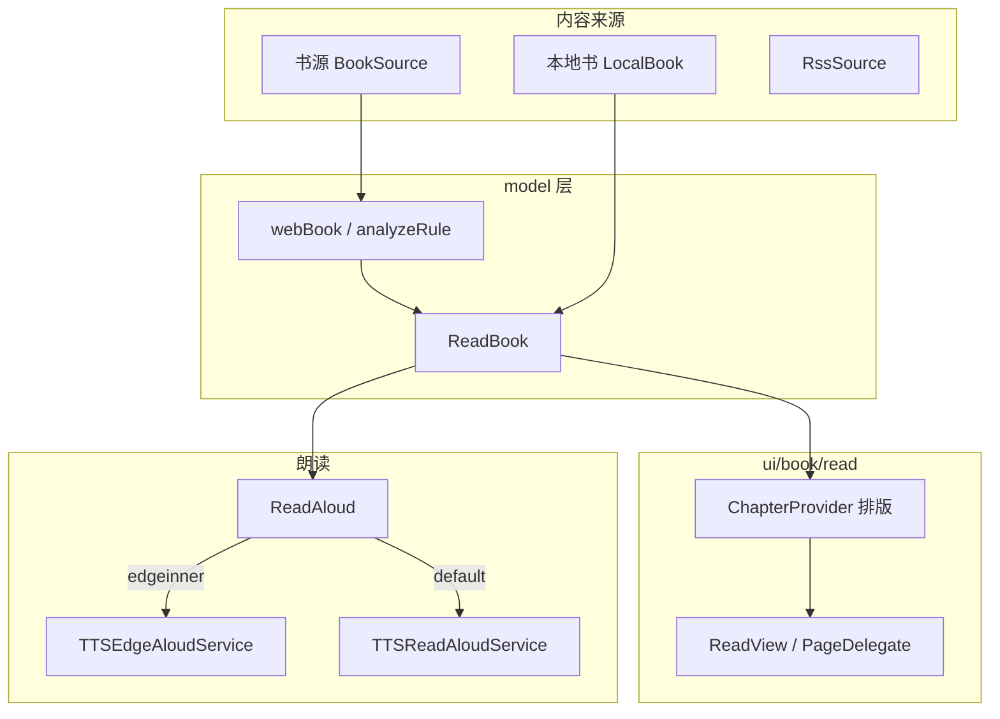

# ddo-tts 项目结构分析

> 生成日期：2026-06-03  
> 仓库路径：`/Users/zhaoyk10/me/projects/ddo-tts`

---

## 1. 项目概览

### 1.1 项目定位

**ddo-tts** 是基于开源 Android 电子书阅读器 **Legado（阅读）** 的 Fork，包名仍为 `io.legado.app`。在保留原项目「书源规则 + 本地/网络阅读 + RSS + Web 管理」等能力的基础上，本仓库的核心差异化是：

- **内置 Microsoft Edge TTS（大声朗读）**：基于 [rany2/edge-tts](https://github.com/rany2/edge-tts)，无需单独安装第三方 TTS 引擎。
- **音频缓存策略优化**：将 Edge TTS 音频从「按段落写磁盘再删除」改为 **内存缓存（`HashMap<String, ByteArray>`）**，读完一章后释放已播放媒体，减少频繁 I/O。
- **Edge 客户端版本对齐**：`EdgeSpeakFetch` 中 Chromium 版本为 `143.0.3650.75`，与 edge-tts 同步。
- **朗读与手动翻页解耦**：朗读中手动翻页不重启朗读；`aloudSyncView` 控制视图是否跟随；朗读面板提供「去朗读页」「从本页读」。详见 `docs/TTS_ANALYSIS.md` §3.3。

README 说明主仓 Legado 已停更，本仓库作为可继续维护的衍生版本使用。

### 1.2 技术栈摘要

| 类别 | 技术 |
|------|------|
| 语言 | Kotlin 为主，少量 Java（ICU 字符集、epublib、Rhino 等） |
| 构建 | Gradle 8.x + AGP 8.13.2 + Version Catalog (`gradle/libs.versions.toml`) |
| UI | ViewBinding、Material、Fragment、自定义阅读 View |
| 数据库 | Room 2.7.1，schema 版本 **75**，KSP 编译 |
| 网络 | OkHttp 5.x、Cronet（`app/cronetlib` 本地 AAR/JAR） |
| 规则引擎 | Rhino JS（`:modules:rhino`）、Jsoup、JsonPath、XPath |
| 本地书格式 | TXT、EPUB、MOBI/AZW、PDF（图片）、UMD（`:modules:book`） |
| 朗读 | 系统 TTS、HTTP TTS、**Edge TTS**、豆包 TTS |
| 播放 | Media3 ExoPlayer（Edge/HTTP 朗读流式播放） |
| 内嵌 Web | NanoHTTPD + `assets/web` 静态页；`modules/web` 为独立 Vue3 管理端源码（未编入 `settings.gradle`） |
| 统计/性能 | Firebase Analytics & Perf |

### 1.3 规模统计（约）

| 指标 | 数量 |
|------|------|
| 主模块 Kotlin 源文件 | ~809 |
| Layout XML | ~183 |
| Drawable XML | ~167 |
| Room 导出 schema 文件 | 75 |
| Gradle 子模块（已 include） | 3：`app`、`modules:book`、`modules:rhino` |

---

## 2. 仓库根目录结构

```
ddo-tts/
├── app/                    # 主应用模块（几乎全部业务代码）
├── modules/
│   ├── book/               # EPUB / UMD 解析库（Java）
│   ├── rhino/              # Rhino JS 引擎封装（书源规则执行）
│   └── web/                # Legado Web 管理端（Vue3 + Vite，独立前端工程）
├── gradle/
│   ├── libs.versions.toml  # 依赖版本目录
│   └── wrapper/
├── build.gradle            # 根构建脚本、compileSdk=36
├── settings.gradle         # 仅 include app + book + rhino
├── gradle.properties
├── README.md               # 本 Fork 说明（Edge TTS 等）
├── LICENSE
├── PROJECT_STRUCTURE.md    # 本文档
└── .github/                # CI、Issue 模板、Dependabot
```

**注意**：`modules/web` 存在完整 `package.json` 与 Vue 源码，但 **未** 在 `settings.gradle` 中作为 Android 模块引入；构建产物通过 `scripts/sync.js` 等方式同步到 `app/src/main/assets/web/vue`（assets 中已有打包后的 `index.html` 与 chunk）。

---

## 3. Gradle 模块详解

### 3.1 `:app`（主应用）

- **namespace**：`io.legado.app`
- **applicationId**：`io.legado.app`（release 后缀 `.release`，debug 后缀 `.debug`）
- **minSdk 21 / targetSdk 36 / compileSdk 36**
- **Java/Kotlin**：JVM 17，coreLibraryDesugaring 开启
- **特性**：ViewBinding、BuildConfig、Room schema 导出至 `app/schemas/`
- **版本号**：`3.yy.MMddHH`（GMT+8）+ `versionCode = 10000 + git commit 数`
- **Product Flavor**：`app`（channel `APP_CHANNEL_VALUE=app`）
- **签名**：可选 `RELEASE_STORE_*` 属性
- **特殊目录**：
  - `app/cronetlib/`：Cronet 二进制依赖
  - `app/schemas/io.legado.app.data.AppDatabase/`：Room 迁移 JSON（1–75）
  - `app/download.gradle`：构建期下载任务（如 Cronet 等）

### 3.2 `:modules:book`

- **namespace**：`me.ag2s`
- **职责**：本地电子书格式解析，供 `app` 的 `model/localBook` 调用
- **主要包**：
  - `me.ag2s.epublib.*`：EPUB 读写（domain、epub、util、zip）
  - `me.ag2s.umdlib.*`：UMD 格式
- **资源**：内含 XHTML DTD 等 `src/main/resources/dtd/`

### 3.3 `:modules:rhino`

- **namespace**：`com.script`
- **依赖**：Mozilla Rhino `1.8.1`（固定版本，兼容低 API）
- **职责**：在书源/订阅源规则中执行 JavaScript；`App.kt` 中初始化 `RhinoScriptEngine`、`ReadOnlyJavaObject` 等

---

## 4. 主应用包结构 `io.legado.app`

官方在 `app/src/main/java/io/legado/app/README.md` 中给出了顶层划分，下文在其基础上展开。

```
io.legado.app/
├── App.kt                  # Application 入口：DB、Cronet、主题、LiveEventBus、Rhino 等
├── api/                    # 对外 ContentProvider / 控制器
├── base/                   # Activity/Fragment/Adapter 基类
├── constant/               # 常量、PreferKey、IntentAction、EventBus 等
├── data/                   # Room 数据库
├── exception/              # 业务异常类型
├── help/                   # 配置、网络、存储、书源扩展、TTS 辅助等
├── lib/                    # 自研/ vendored 库（mobi、cronet、theme、webdav…）
├── model/                  # 阅读/下载/书源解析核心逻辑
├── receiver/               # 广播、分享、媒体键
├── service/                # 前台服务：朗读、下载、Web、缓存、导出
├── ui/                     # 全部界面（最大包，~359 个 kt 文件）
├── utils/                  # 工具类
└── web/                    # 应用内 Web 服务（NanoHTTPD）与 Socket
```

### 4.1 `api` — 对外接口（7 个文件）

| 文件 | 作用 |
|------|------|
| `ReaderProvider.kt` | ContentProvider，供外部读取书架等（Manifest 中 `exported=true`） |
| `ReturnData.kt` | API 返回封装 |
| `ShortCuts.kt` | 快捷方式相关 |
| `controller/BookController.kt` | 书籍 REST 风格操作 |
| `controller/BookSourceController.kt` | 书源管理 API |
| `controller/RssSourceController.kt` | 订阅源 API |
| `controller/ReplaceRuleController.kt` | 替换规则 API |

与 `service/WebService` + `assets/web` 配合，实现局域网 Web 管理。

### 4.2 `base` — 基类（19 个文件）

- `BaseActivity`、`BaseFragment`、`BaseViewModel` 等
- `base/adapter`：RecyclerView 适配器基类及动画
- `BasePrefDialogFragment`：设置对话框基类

### 4.3 `constant` — 常量（13 个文件）

包含 `AppConst`、`PreferKey`、`IntentAction`、`EventBus`、`Theme`、`AppPattern` 等全局约定。

### 4.4 `data` — 持久层（61 个文件）

#### 数据库 `AppDatabase`

- **版本**：75（`exportSchema = true`）
- **访问**：`val appDb by lazy { Room.databaseBuilder(...) }`
- **策略**：早期版本 `fallbackToDestructiveMigrationFrom(1..9)` + 手动 `DatabaseMigrations` + 大量 `AutoMigration(43→75)`

#### 实体（entities）

| 实体 | 说明 |
|------|------|
| `Book` / `BookChapter` / `BookGroup` | 书架、章节、分组 |
| `BookSource` + `BookSourcePart`(view) | 书源及列表视图 |
| `Bookmark` / `ReadRecord` | 书签、阅读记录 |
| `ReplaceRule` / `TxtTocRule` | 替换净化、TXT 目录规则 |
| `SearchBook` / `SearchKeyword` | 搜索结果与关键词 |
| `Cookie` / `Cache` | Cookie 与缓存 |
| `RssSource` / `RssArticle` / `RssReadRecord` / `RssStar` | RSS 订阅体系 |
| `HttpTTS` | HTTP 朗读引擎配置 |
| `RuleSub` / `DictRule` / `KeyboardAssist` / `Server` | 规则订阅、字典、键盘辅助、服务器配置 |

#### 规则子包 `entities/rule`

`BookInfoRule`、`ContentRule`、`SearchRule`、`ExploreRule`、`TocRule`、`BookListRule` 等 — 与 JSON 书源格式一一对应。

#### DAO（dao 包）

每个实体对应一个 `@Dao` 接口，如 `BookDao`、`BookSourceDao`、`HttpTTSDao` 等，共约 20 个。

### 4.5 `exception` — 异常（8 个文件）

如 `ContentEmptyException` 等内容拉取失败类型，供 `model/webBook` 与 UI 统一处理。

### 4.6 `help` — 业务辅助（84 个文件）

| 子包 | 职责 |
|------|------|
| `help/config` | `AppConfig`、`ReadBookConfig`、`ThemeConfig`、`SourceConfig` |
| `help/book` | `BookHelp`、`ContentProcessor`、`ContentHelp` |
| `help/http` | OkHttp、Cronet、`CookieManager`、拦截器 |
| `help/storage` | `Backup`/`Restore`、AES、导入旧数据 |
| `help/source` | 书源/RSS 扩展、校验 |
| `help/glide` | 封面与图片加载 |
| `help/coroutine` | 自定义协程封装 |
| `help/crypto` | 书源加解密（Hutool 等） |
| `help/exoplayer` | 朗读/音频 DataSource |
| `help/rhino` | `NativeBaseSource` 等 JS 桥接 |
| `help/update` | GitHub 等更新检查 |
| 根级 | `TTS.kt`（系统 TTS 单例）、`AppWebDav`、`DefaultData`、`CrashHandler` |

### 4.7 `lib` — 内置库（93 个文件）

| 子包 | 职责 |
|------|------|
| `lib/mobi` | Kindle MOBI/AZW 解析（KF6/KF8、解压 Huffcdic/Lz77 等） |
| `lib/cronet` | Chromium Cronet 封装与拦截器 |
| `lib/theme` | 主题色、Tint、`Theme*` 自定义 View |
| `lib/prefs` | 自定义 Preference 与对话框 |
| `lib/permission` | 运行时权限 |
| `lib/webdav` | WebDAV 同步书籍/备份 |
| `lib/dialogs` | Alert/Selector 封装 |
| `lib/aliyun` | 阿里云相关 |
| `lib/icu4j` | 字符集探测（Java） |

### 4.8 `model` — 核心业务（40 个文件）

| 子包 | 职责 |
|------|------|
| `model/ReadBook.kt` | **阅读会话单例**：章节切换、进度、与 UI 联动；**朗读视图解耦**（`aloudSyncView`、`goToAloudPage`、`tryAutoRejoinAloudSync` 等） |
| `model/ReadAloud.kt` | **朗读调度**：按 `ttsEngine` 选择 Service |
| `model/ReadManga.kt` | 漫画阅读逻辑 |
| `model/webBook` | 网络书源：`WebBook`、`BookContent`、`BookList`、`SearchModel`… |
| `model/analyzeRule` | 规则解析：`AnalyzeRule`、`AnalyzeByJSoup`、`AnalyzeByXPath`、`AnalyzeByJSonPath` |
| `model/localBook` | 本地导入：`LocalBook`、`TextFile`、`EpubFile`、`MobiFile`、`PdfFile`、`UmdFile` |
| `model/rss` | RSS 解析默认/按规则 |
| `model/remote` | 远程书架 WebDAV |
| 其他 | `Download`、`CacheBook`、`CheckSource`、`BookCover`、`AudioPlay` |

**朗读引擎路由**（`ReadAloud.getReadAloudClass()`）：

```
ttsEngine 为空          → TTSReadAloudService（系统 TTS）
包含 "edgeinner"        → TTSEdgeAloudService（本 Fork 重点）
包含 "doubao"           → TTSDouBaoAloudService
纯数字 ID               → HttpReadAloudService（查 HttpTTS 表）
默认                    → TTSReadAloudService
```

### 4.9 `service` — 前台服务（14 个文件）

| Service | 类型 | 说明 |
|---------|------|------|
| `TTSEdgeAloudService` | mediaPlayback | **Edge TTS 朗读**，ExoPlayer + 内存 `audioCache` |
| `EdgeSpeakFetch` | （非 Service） | WebSocket 连接 `speech.platform.bing.com` 拉取音频流 |
| `TTSReadAloudService` | mediaPlayback | Android 系统 TTS |
| `HttpReadAloudService` | mediaPlayback | 自定义 HTTP TTS |
| `TTSDouBaoAloudService` | mediaPlayback | 豆包 TTS |
| `BaseReadAloudService` | — | 朗读服务基类：通知、段落切分；`aloudChapterIndex`/`aloudChapterPos` 记录朗读进度；未跟随时 `playAloudChapter` 后台切章 |
| `AudioPlayService` | mediaPlayback | 有声书播放 |
| `WebService` | dataSync | 内置 HTTP Web 服务 |
| `WebTileService` | QS Tile | 快捷设置磁贴开关 Web 服务 |
| `DownloadService` | dataSync | 章节/文件下载 |
| `CacheBookService` | dataSync | 批量缓存书籍 |
| `ExportBookService` | dataSync | 导出书籍 |
| `CheckSourceService` | dataSync | 书源检测 |

**Edge TTS 实现要点**（`TTSEdgeAloudService` + `EdgeSpeakFetch`）：

1. `EdgeSpeakFetch` 使用 OkHttp WebSocket，模拟 Edge 浏览器 DRM 参数（`Sec-MS-GEC` 等）。
2. 合成音频写入 `HashMap<String, ByteArray>`，key 多为 MD5；`audioCacheList` 维护顺序。
3. `ExoPlayer` 通过自定义 `ByteArrayDataSourceFactory` 从内存读取，避免磁盘往返。
4. 读完章节后释放对应缓存（Fork 相对原版的存储优化）。

### 4.10 `ui` — 界面层（359 个文件）

#### 4.10.1 导航与主框架

| 包 | 说明 |
|----|------|
| `ui/welcome` | `WelcomeActivity` 启动页；`Launcher1`–`Launcher6` 多图标入口 |
| `ui/main` | `MainActivity`：书架 / 发现 / 我的 / RSS 等 Tab |
| `ui/main/bookshelf/style1|style2` | 两种书架布局 |
| `ui/main/explore` | 发现页 |
| `ui/main/my` | 我的 |
| `ui/main/rss` | RSS 入口 |
| `ui/config` | `ConfigActivity` 总设置 |
| `ui/about` | 关于、阅读记录、捐赠等 |

#### 4.10.2 书籍与阅读（核心）

| 包 | 说明 |
|----|------|
| `ui/book/read` | **`ReadBookActivity`**：正文阅读主界面 |
| `ui/book/read/page` | 排版引擎：`ReadView`、`PageView`、`TextChapter`/`TextPage`/`TextLine`、`PageDelegate`（仿真/滑动/覆盖/横向/无动画） |
| `ui/book/read/page/provider` | `ChapterProvider`、`TextChapterLayout`、`ZhLayout` 中文排版 |
| `ui/book/read/config` | 阅读样式、朗读配置、`SpeakEngineDialog`、`ReadAloudConfigDialog` |
| `ui/book/manga` | `ReadMangaActivity` 漫画模式 |
| `ui/book/toc` | 目录 |
| `ui/book/info` | 书籍详情与编辑 |
| `ui/book/search` | 书源搜索 |
| `ui/book/searchContent` | 全书搜索 |
| `ui/book/source` | 书源管理/编辑/调试 |
| `ui/book/import` | 本地/远程导入 |
| `ui/book/cache` | 缓存管理 |
| `ui/book/explore` | 书源发现页 |
| `ui/book/audio` | 音频书播放界面 |
| `ui/book/bookmark` | 书签列表 |
| `ui/book/group` | 分组 |
| `ui/book/manage` | 书架整理 |
| `ui/book/changecover` / `changesource` | 换封面、换源 |

阅读页采用 **自定义 View 分页排版**，而非 WebView 渲染正文（EPUB 导出 HTML 另有一套 `assets/epub` 模板）。

#### 4.10.3 RSS、替换、关联导入

| 包 | 说明 |
|----|------|
| `ui/rss/*` | 订阅源、文章列表、阅读、收藏、调试 |
| `ui/replace` | 替换净化规则 |
| `ui/association` | 书源导入、`legado://` / `yuedu://` 深链、文件关联 |
| `ui/login` | 书源登录 WebView |
| `ui/browser` | 通用 WebView |
| `ui/file` | 文件管理 |
| `ui/dict` | 字典规则 |
| `ui/font` | 字体 |
| `ui/qrcode` | 扫码 |
| `ui/widget` | 大量自定义控件（文本选择、RecyclerView、键盘、图片预览等） |

#### 4.10.4 Activity 数量

Manifest 注册约 **40+** Activity，覆盖阅读、书源、RSS、配置、导入、关联启动等全场景。

### 4.11 `utils` — 工具（100 个文件）

包含扩展函数、MD5、压缩、ViewBinding 委托、`canvasrecorder`（阅读动画录制）、`objectpool` 等。

### 4.12 `web` — 应用内 Web 服务（6 个文件）

与 `service/WebService` 配合，提供书架/书源/替换规则等的 HTTP API 与 WebSocket（`web/socket`）。

### 4.13 `receiver` — 广播（4 个文件）

- `MediaButtonReceiver`：耳机/蓝牙媒体键控制朗读
- `SharedReceiverActivity`：分享文本导入
- 其他与定时、系统事件相关接收器

---

## 5. 资源与资产 `app/src/main`

### 5.1 `res/`

- **layout/**：~183 个界面布局
- **drawable/**：图标、背景、矢量图
- **values/**：字符串、颜色、主题、dimens；含 `values-zh-rTW` 等本地化
- **values-night/**：夜间配色
- **menu/**、**xml/**：菜单、网络安全、`file_paths`、S Pen 远程操作等
- **mipmap/**：应用图标及多套 Launcher 图标

### 5.2 `assets/`

| 路径 | 内容 |
|------|------|
| `assets/web/` | 内置 Web UI：帮助文档（markdown）、上传书籍、Vue 打包页 |
| `assets/defaultData/` | 默认书源、RSS、朗读、主题、键盘辅助等 JSON |
| `assets/epub/` | EPUB 导出 HTML/CSS 模板 |
| `assets/*.md` | 隐私政策、免责声明、更新日志 |
| `assets/cronet.json` | Cronet 配置 |
| `assets/18PlusList.txt` | 18+ 关键词列表 |

### 5.3 其他源码集

- `src/debug/`：Debug 专用资源
- `src/androidTest/`、`src/test/`：测试（含 Room schema 作为 androidTest assets）

---

## 6. AndroidManifest 能力矩阵

### 6.1 权限（节选）

网络、唤醒、存储（含 `MANAGE_EXTERNAL_STORAGE`）、前台服务（`mediaPlayback` / `dataSync`）、通知、安装包、电话状态等。

### 6.2 支持的文件类型（`FileAssociationActivity`）

TXT、JSON、EPUB、PDF、MOBI、AZW/AZW3、ZIP/RAR/7z 等；支持 `content://`、`file://` 及多类 MIME。

### 6.3 深链与分享

- `legado://`、`yuedu://` → 在线导入书源等
- `ACTION_SEND` / `PROCESS_TEXT` → 文本分享处理

---

## 7. 阅读数据流（简化）



1. 用户打开书籍 → `ReadBookActivity` 加载 `ReadBook` 当前章节。
2. 章节正文来自网络书源规则或 `localBook` 解析。
3. `ChapterProvider` 将文本拆为 `TextChapter` → `TextPage` → `TextLine` → `Column`，由 `ReadView` 绘制。
4. 点击朗读 → `ReadAloud.play()` 启动对应 `Service`；Edge 路径下异步拉流并由 ExoPlayer 播放。
5. 朗读中手动翻页 → `aloudSyncView=false`，朗读继续；追上当前页或点「去朗读页」→ 恢复高亮与自动翻页。

---

## 8. 子模块 `modules/book` 结构

```
me.ag2s/
├── base/
├── epublib/
│   ├── domain/          # OPF、Manifest、Metadata
│   ├── epub/            # EPUB 读写主逻辑
│   ├── browsersupport/
│   └── util/            # ZIP、IO、ResourceUtil
└── umdlib/
    ├── domain/
    ├── tool/
    └── umd/
```

`app` 中 `EpubFile` / `UmdFile` 通过该模块解析后，统一进入 `Book` + `BookChapter` 数据模型。

---

## 9. 子模块 `modules/rhino` 结构

```
com.script.rhino/
├── RhinoScriptEngine
├── RhinoCompiledScript
├── RhinoWrapFactory
└── ReadOnlyJavaObject 等
```

书源规则中的 `@js`、`java.ajax` 等均依赖此模块在沙箱中执行 JS。

---

## 10. `modules/web`（独立前端）

- **栈**：Vue 3.5 + Vite + TypeScript + Pinia + Element Plus
- **用途**：浏览器端管理书源、订阅源、书籍（开发时 `pnpm dev`，构建后同步到 app assets）
- **目录**：`src/pages`、`src/views`、`src/api`、`src/store`、`src/router`、`src/components`
- **未纳入 Android 多模块构建**，需单独 Node 环境维护

---

## 11. 构建与 CI

- **依赖管理**：`gradle/libs.versions.toml` 统一版本；Kotlin `2.3.0`、KSP `2.3.4`
- **ProGuard**：Release 开启混淆与资源收缩；含 `cronet-proguard-rules.pro`
- **Firebase**：`google-services` 插件（需 `google-services.json` 方可完整编译）
- **.github/workflows**：自动化构建/检查（具体 job 见仓库 workflows）

---

## 12. 本 Fork 修改热点（便于二次开发）

| 路径 | 说明 |
|------|------|
| `model/ReadBook.kt` | 朗读视图解耦、`aloudSyncView`、`goToAloudPage` / `readAloudFromCurrentPage` |
| `service/BaseReadAloudService.kt` | `aloudChapter*`、`upTtsProgress`、未跟随时的 `playAloudChapter` |
| `service/TTSEdgeAloudService.kt` | Edge 朗读服务、内存缓存、ExoPlayer |
| `service/EdgeSpeakFetch.kt` | Bing Speech WebSocket 协议与 DRM 参数 |
| `ui/book/read/ReadBookActivity.kt` | `applyAloudSpan`、`TTS_PROGRESS` / `ALOUD_STATE` 高亮逻辑 |
| `ui/book/read/config/ReadAloudDialog.kt` | 朗读控制条、「去朗读页」「从本页读」 |
| `model/ReadAloud.kt` | `edgeinner` 引擎名路由 |
| `ui/book/read/config/SpeakEngine*.kt` | 朗读引擎 UI 配置 |
| `docs/TTS_ANALYSIS.md` | 朗读全链路文档（含 §3.3 翻页解耦） |
| `README.md` | Fork 动机与 Edge 版本说明 |

排查朗读问题时建议从 `docs/TTS_ANALYSIS.md` 入手，并关注 `AppConfig` / SharedPreferences 中的音色键值（如 `晓晓@zh-CN-XiaoxiaoNeural`）。

---

## 13. 依赖关系总览

```
                    ┌─────────────┐
                    │    :app     │
                    └──────┬──────┘
           ┌───────────────┼───────────────┐
           ▼               ▼               ▼
    ┌────────────┐  ┌────────────┐  ┌──────────────┐
    │:modules:book│  │:modules:rhino│  │ Maven 依赖   │
    └────────────┘  └────────────┘  │ Room/Media3/  │
                                    │ OkHttp/Glide… │
                                    └──────────────┘

    modules/web (Node) ──build/sync──► app/src/main/assets/web/vue
```

---

## 14. 总结

**ddo-tts** 是一个功能完整的 **Legado 衍生阅读器**：以 `app` 单体承载 UI、书源规则、排版引擎、数据层与多种前台服务；`book` 与 `rhino` 模块分担格式解析与脚本执行。本仓库在架构上与原 Legado 一致，差异集中在 **Edge TTS 内置实现、内存化音频缓存、朗读与手动翻页解耦**，适合需要高质量朗读且可边听边自由浏览正文的场景。

如需深入某一子系统，建议阅读顺序：

1. 阅读体验：`ui/book/read` + `model/ReadBook.kt`
2. 书源规则：`model/analyzeRule` + `data/entities/BookSource.kt`
3. 本地书：`model/localBook` + `:modules:book`
4. 朗读：`model/ReadAloud.kt` → `service/TTSEdgeAloudService.kt` → `EdgeSpeakFetch.kt`
5. 数据：`data/AppDatabase.kt` + `entities/*`

---

*文档由代码库静态分析生成，若后续模块或版本变更，请以实际源码为准。*
