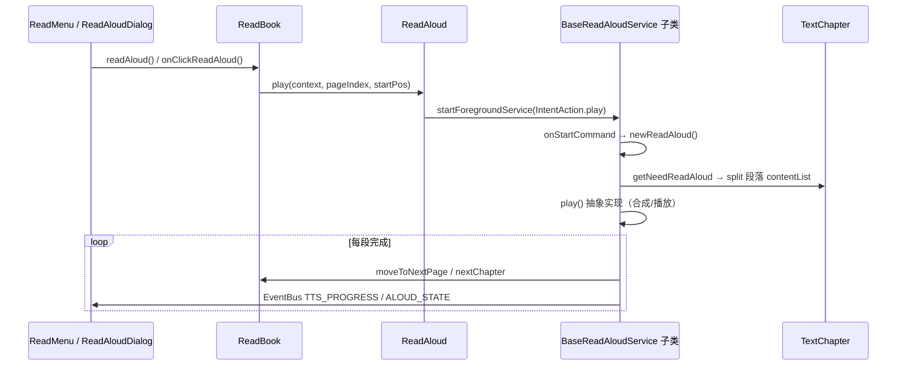
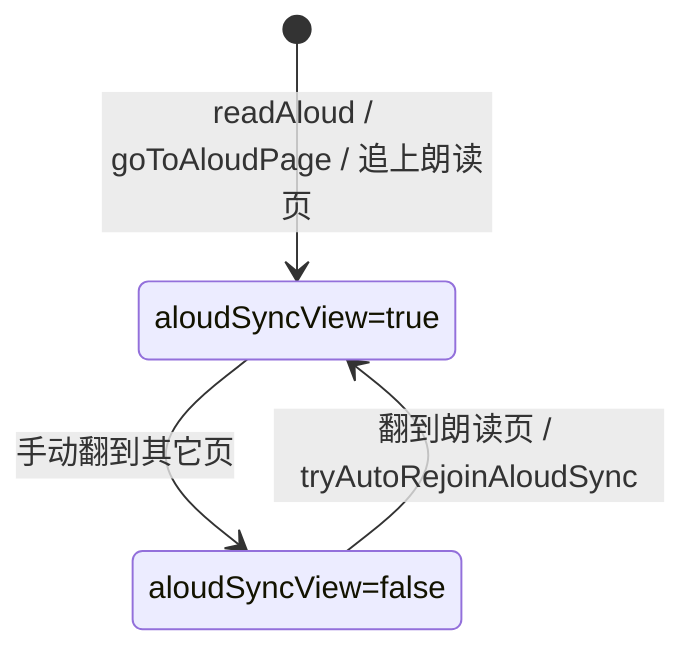
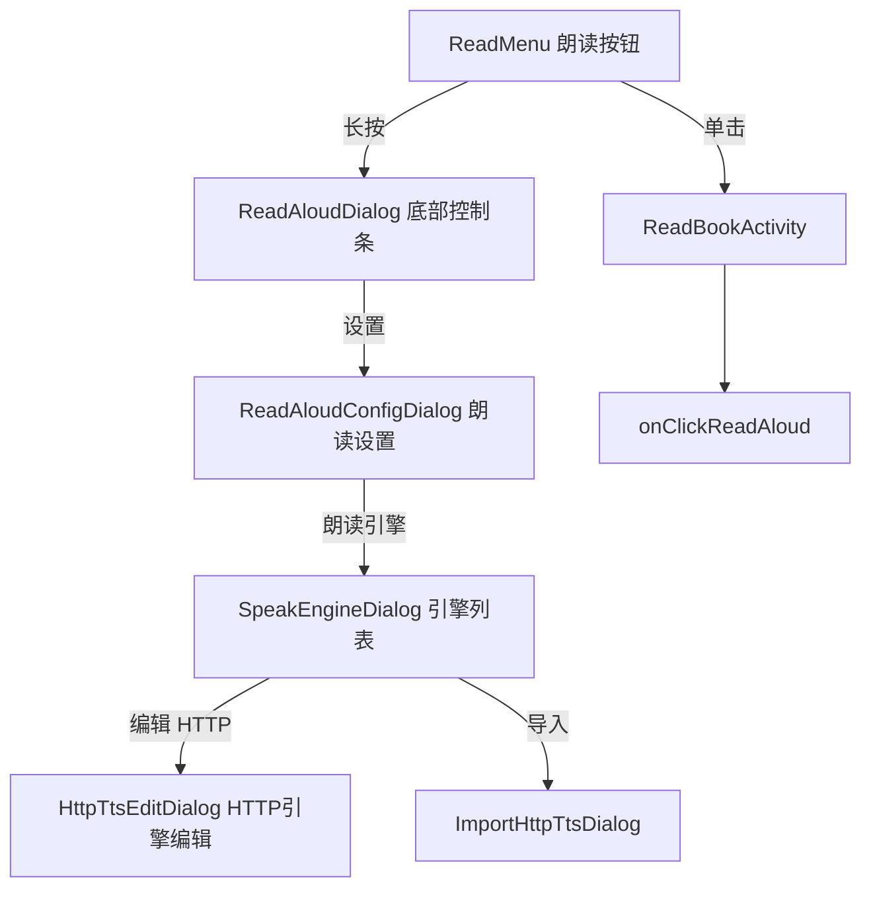
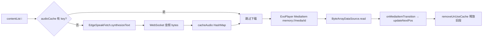

# TTS / 朗读功能详细分析

> 生成日期：2026-06-03（朗读翻页解耦：2026-06-03 增补）  
> 适用仓库：`ddo-tts`（Legado Fork，包名 `io.legado.app`）

本文档面向**修改朗读引擎、朗读 UI、Edge TTS 行为**等需求，按「执行流程 → 分层文件职责 → UI 入口 → 配置与事件」组织。

---

## 1. 功能边界：两套「发声」体系

项目中与 TTS 相关的能力分为两条**独立**链路，修改时不要混淆：

| 体系 | 用途 | 核心类 | 是否前台 Service |
|------|------|--------|------------------|
| **章节朗读（Read Aloud）** | 从当前页/段开始连续朗读全书 | `ReadAloud` → `BaseReadAloudService` 子类 | 是 |
| **划词朗读（Selection TTS）** | 用户选中一段文字后临时朗读 | `help/TTS.kt` | 否，进程内 `TextToSpeech` |

下文**默认指章节朗读**；第 12 节单独说明划词朗读。

---

## 2. 朗读引擎类型与路由

### 2.1 引擎标识如何存储

引擎选择最终是一个 **字符串** `ttsEngine`，来源优先级（`ReadAloud.ttsEngine`）：

```
ReadBook.book?.getTtsEngine()  ??  AppConfig.ttsEngine
```

| 存储位置 | 字段 | 说明 |
|----------|------|------|
| 单本书 | `Book.config.ttsEngine` | 每本书可覆盖全局引擎；`Book.setTtsEngine()` / `getTtsEngine()` |
| 全局 | `SharedPreferences` key `appTtsEngine`（`PreferKey.ttsEngine`） | `AppConfig.ttsEngine` |

**字符串格式**：

| 格式 | 示例 | 对应 Service |
|------|------|----------------|
| 空 / 缺省 | `null` | `TTSReadAloudService`（系统默认 TTS） |
| JSON `SelectItem` | `{"title":"Edge大声朗读","value":"edgeinner"}` | 见 `value` 字段 |
| `edgeinner` | 含子串 `edgeinner` | `TTSEdgeAloudService` |
| `doubao` | 含子串 `doubao` | `TTSDouBaoAloudService` |
| `mimo` | 含子串 `mimo` | `TTSMiMoAloudService` |
| 纯数字 | `"1735123456789"` | `HttpReadAloudService`（Room `httpTTS` 表主键 id） |
| JSON + 系统引擎名 | `{"title":"谷歌","value":"com.google.android.tts"}` | `TTSReadAloudService`（指定 `TextToSpeech` 包名） |

路由逻辑在 `ReadAloud.getReadAloudClass()`：

```29:47:app/src/main/java/io/legado/app/model/ReadAloud.kt
    private fun getReadAloudClass(): Class<*> {
        val ttsEngine = ttsEngine
        if (ttsEngine.isNullOrBlank()) {
            return TTSReadAloudService::class.java
        }
        if (ttsEngine.contains("edgeinner")) {
            return TTSEdgeAloudService::class.java
        }
        if (ttsEngine.contains("doubao")) {
            return  TTSDouBaoAloudService::class.java
        }
        if (ttsEngine.contains(MiMoTtsContract.ENGINE_VALUE)) {
            return TTSMiMoAloudService::class.java
        }
        if (StringUtils.isNumeric(ttsEngine)) {
            httpTTS = appDb.httpTTSDao.get(ttsEngine.toLong())
            if (httpTTS != null) {
                return HttpReadAloudService::class.java
            }
        }
        return TTSReadAloudService::class.java
    }
```

切换引擎后必须调用 `ReadAloud.upReadAloudClass()`（内部 `stop` + 重新解析 Class）。

### 2.2 Edge / 豆包 / MiMo 的额外配置（SharedPreferences）

与全局 `appTtsEngine` 分离，使用 **`TTS_CONFIG`** 文件（`Context.MODE_PRIVATE`）：

| Key | 设置位置 | 读取位置 | 含义 |
|-----|----------|----------|------|
| `tts_edge_voice` | `SpeakEngineDialog` 嗓音 Spinner | `TTSEdgeAloudService.getVoiceValue()` | 如 `晓晓@zh-CN-XiaoxiaoNeural`，播放时取 `@` 后 Neural 名 |
| `tts_doubao_cookie` | `SpeakEngineDialog` Cookie 输入框 | `TTSDouBaoAloudService` | 豆包会话 Cookie |
| `tts_mimo_api_key` | `MiMoTtsConfigDialog` | `MiMoTtsConfigStore.loadGlobal()` | 用户自备 MiMo API Key；明文保存在应用私有 `TTS_CONFIG` |
| `tts_mimo_voice` | `MiMoTtsConfigDialog` | `MiMoTtsConfigStore.loadGlobal()` | 固定模型 `mimo-v2.5-tts` 的预置音色；仅可取应用支持列表 |
| `tts_mimo_style` | `MiMoTtsConfigDialog` | `MiMoTtsConfigStore.resolve()` | 全局风格；单书风格留空时继承此值 |
| `Book.ReadConfig.mimoTtsStyle` | `MiMoTtsConfigDialog`（本书） | `MiMoTtsConfigStore.resolve()` | 单书只覆盖风格，不覆盖 API Key 或音色；空值继承全局风格 |

---

## 3. 端到端执行流程

### 3.1 总览时序图



### 3.2 用户点击「朗读」典型路径

1. **`ReadMenu`**：`llReadAloud` 单击 → `callBack.onClickReadAloud()`；长按 → `showReadAloudDialog()`。
2. **`ReadBookActivity.onClickReadAloud()`**：
   - 未运行： `ReadAloud.upReadAloudClass()` → 按滚动模式计算 `startPos` → `ReadBook.readAloud(startPos)`。
   - 已暂停：滚动翻页模式可能重新定位；否则 `ReadAloud.resume()`。
   - 播放中：`ReadAloud.pause()`。
3. **`ReadBook.readAloud()`**：章节排版完成（`textChapter.isCompleted`）后调用 `ReadAloud.play(appCtx, play, startPos)`。
4. **`ReadAloud.play()`**：向当前 `aloudClass` 发 `IntentAction.play`，携带 `pageIndex`、`startPos`。
5. **`BaseReadAloudService.newReadAloud()`**（IO 线程）：
   - 取 `ReadBook.curTextChapter`；
   - `getNeedReadAloud(0, readAloudByPage, 0)` 得到本章待读文本；
   - 按 `\n` 拆成 `contentList`（每元素一段）；
   - 计算 `nowSpeak`、`readAloudNumber`、`paragraphStartPos`；
   - 主线程调用子类 `play()`。
6. **子类 `play()`**：请求音频焦点 → 合成/下载音频 → 播放；段末 `nextParagraph` 或 `nextChapter()`。

### 3.3 翻页 / 换章与朗读联动（视图解耦）

本 Fork 将朗读进度与阅读视图**解耦**（行为参考起点阅读）：朗读进行中用户手动翻页**不会**重启朗读；视图是否跟随朗读由 `ReadBook.aloudSyncView` 控制。

#### 3.3.1 核心状态

| 符号 | 位置 | 含义 |
|------|------|------|
| `aloudSyncView` | `ReadBook` | `true`：视图跟随朗读（高亮、自动翻页、进度写入 `durChapterPos`）；手动翻到非朗读页后为 `false` |
| `aloudChapterIndex` / `aloudChapterPos` | `BaseReadAloudService` 伴生对象 | 朗读真实进度，可与 `durChapterIndex` / `durChapterPos` 不一致 |
| `allowTtsChapterChange` | `ReadBook` | TTS 自动切章时短暂为 `true`，允许 `curPageChanged` 触发 `readAloud` 续播 |
| `navigatingToAloudPage` | `ReadBook` | 「去朗读页」等程序跳转，不算用户手动浏览 |

#### 3.3.2 行为对照表

| 场景 | 行为 |
|------|------|
| 朗读中 `setPageIndex` / `skipToPage` / `openChapter`（用户操作） | `aloudSyncView = false`；Service 继续按 `aloudChapter*` 朗读，**不** `readAloud()` 重开 |
| 用户翻到**朗读所在页**（`setPageIndex`） | `shouldRejoinAloudSync` → `aloudSyncView = true`，`durChapterPos` 对齐 `aloudChapterPos`，`refreshAloudViewSync()` |
| 朗读进度追上用户当前所见页 | `tryAutoRejoinAloudSync()`（`TTS_PROGRESS` / `moveToNextPage` 入口）→ 自动 `aloudSyncView = true` |
| `curPageChanged(pageChanged=true)` 且朗读在跑 | 仅 `aloudSyncView = false`（不再 `readAloud` 重启） |
| `curPageChanged(pageChanged=false)` 且 `allowTtsChapterChange` | TTS 自动切章后 `readAloud(!pause)` |
| `moveToNextPage()` / `moveToPrevPage()` | 先 `tryAutoRejoinAloudSync()`；仅 `aloudSyncView` 时更新视图；Service 侧先 `upTtsProgress` 再调用 |
| `nextChapter()` / `prevChapter()` 且 `!aloudSyncView` | 只更新 `aloudChapterIndex`，`ReadBook.playAloudChapter()` 后台加载章节朗读，**不**改用户当前章节视图 |
| `nextChapter()` / `prevChapter()` 且 `aloudSyncView` | 与原 Legado 类似：`moveToNextChapter` + `allowTtsChapterChange` |
| `ReadBookActivity` 监听 `TTS_PROGRESS` | `applyAloudSpan`：尝试重连后，仅 `aloudSyncView` 且同章时更新高亮与 `durChapterPos` |
| `ALOUD_STATE == STOP` | 清除高亮；**暂停（PAUSE）不再清除高亮** |

#### 3.3.3 用户操作入口（`ReadAloudDialog`）

| 按钮 | 字符串 key | 调用 |
|------|------------|------|
| 去朗读页 | `go_to_aloud_page` | `ReadBook.goToAloudPage()` — 跳到 `aloudChapterIndex` / `aloudChapterPos`，`navigatingToAloudPage` 防误判 |
| 从本页读 | `read_aloud_from_this_page` | `ReadBook.readAloudFromCurrentPage()` — `aloudSyncView = true`，从当前 `durPageIndex` 重开朗读 |

布局：`res/layout/dialog_read_aloud.xml`（`ll_go_aloud_page`、`ll_read_from_page`）。

#### 3.3.4 状态流转（简图）



### 3.4 Intent 动作一览（Service 控制）

定义于 `IntentAction`，由 `ReadAloud` 静态方法或通知 PendingIntent 发送：

| action | 触发方 | Service 行为 |
|--------|--------|----------------|
| `play` | 开始/重新开始朗读 | `newReadAloud(play, pageIndex, startPos)` |
| `pause` | UI / 通知 / 音频焦点丢失 | `pauseReadAloud()` |
| `resume` | UI / 通知 | `resumeReadAloud()` → 子类继续播放 |
| `stop` | UI 停止 | `stopSelf()` |
| `prevParagraph` / `nextParagraph` | 朗读面板 / 媒体键 | `prevP()` / `nextP()` |
| `prev` / `next` | 通知上一章/下一章 | `prevChapter()` / `nextChapter()` |
| `upTtsSpeechRate` | 语速 SeekBar | `upSpeechRate(true)` |
| `setTimer` / `addTimer` | 定时 | `setTimer(minute)` / `addTimer()` |

### 3.5 EventBus 事件

| 常量 | 载荷 | 订阅方（主要） |
|------|------|----------------|
| `READ_ALOUD_PLAY` | `Bundle(play, pageIndex, startPos)` | `BaseReadAloudService` → `newReadAloud` |
| `ALOUD_STATE` | `Status.PLAY` / `PAUSE` / `STOP` | `ReadAloudDialog` 更新播放图标 |
| `TTS_PROGRESS` | `Int` 章节内字符偏移 | `ReadBookActivity.applyAloudSpan`：先 `tryAutoRejoinAloudSync`，再按 `aloudSyncView` 画高亮 |
| `READ_ALOUD_DS` | `Int` 剩余分钟 | `ReadAloudDialog` 定时 SeekBar |
| `MEDIA_BUTTON` | `Boolean` | `ReadBookActivity` 模拟点击朗读键 |

---

## 4. 服务层：`BaseReadAloudService` 与子类

### 4.1 类继承关系

```
BaseService
    └── BaseReadAloudService (abstract)
            ├── TTSReadAloudService      // Android TextToSpeech
            ├── HttpReadAloudService       // HTTP 引擎 + ExoPlayer + 磁盘缓存
            ├── TTSEdgeAloudService        // Edge WebSocket + ExoPlayer + 内存缓存
            ├── TTSDouBaoAloudService      // 豆包 API + ExoPlayer + 内存缓存
            └── TTSMiMoAloudService        // MiMo HTTP + ExoPlayer + 内存 WAV 缓存
```

### 4.2 `BaseReadAloudService.kt` — 公共骨架

**路径**：`app/src/main/java/io/legado/app/service/BaseReadAloudService.kt`

| 职责 | 说明 |
|------|------|
| 生命周期状态 | 伴生对象 `isRun`、`pause`、`timeMinute` |
| 朗读进度（与视图可分离） | `aloudChapterIndex`、`aloudChapterPos`；`upTtsProgress()` 更新并 post `TTS_PROGRESS` |
| 段落状态 | `contentList`、`nowSpeak`、`readAloudNumber`、`pageIndex`、`paragraphStartPos` |
| 自动切章 | `nextChapter()` / `prevChapter()`：`aloudSyncView` 为 false 时走 `playAloudChapter`，不改用户当前章 |
| 前台通知 | 播放/暂停/停止/上章/下章/定时；封面来自 `ReadBook.book` |
| 音频焦点 | `requestFocus()` / `abandonFocus()`；可配置忽略（`ignoreAudioFocus`） |
| MediaSession | 锁屏/耳机键；与 `MediaButtonReceiver` 联动 |
| 电话监听 | `pauseReadAloudWhilePhoneCalls` + `READ_PHONE_STATE` |
| 定时关闭 | `doDs()` 每分钟递减 `timeMinute` |
| 抽象方法 | `play()`、`playStop()`、`upSpeechRate()`、`aloudServicePendingIntent()` |

**段落切分入口**（所有引擎共用）：

```236:276:app/src/main/java/io/legado/app/service/BaseReadAloudService.kt
    private fun newReadAloud(play: Boolean, pageIndex: Int, startPos: Int) {
        execute(executeContext = IO) {
            this@BaseReadAloudService.pageIndex = pageIndex
            textChapter = ReadBook.curTextChapter
            // ...
            contentList = textChapter.getNeedReadAloud(0, readAloudByPage, 0)
                .split("\n")
                .filter { it.isNotEmpty() }
            // 计算 nowSpeak, readAloudNumber, paragraphStartPos
            launch(Main) {
                if (play) play() else pageChanged = true
            }
        }
    }
```

### 4.3 `TTSReadAloudService.kt` — 系统 TTS

| 项目 | 内容 |
|------|------|
| 合成 | `android.speech.tts.TextToSpeech` |
| 引擎选择 | `ReadAloud.ttsEngine` 解析 JSON 的 `value` 作为 engine 包名；空则系统默认 |
| 播放 | `speak(text, QUEUE_FLUSH/ADD)` + `UtteranceProgressListener` |
| 进度 | `onStart` / `onRangeStart` 调 `upTtsProgress`、`ReadBook.moveToNextPage` |
| 段末 | `onDone` → `nextParagraph()` 逻辑（更新 `nowSpeak` 或 `nextChapter`） |
| 语速 | `AppConfig.ttsFlowSys` 为 true 时改语速需 `clearTTS`+`initTts`；否则 `setSpeechRate((ttsSpeechRate+5)/10f)` |
| 辅助 | `MediaHelp.playSilentSound` 保活音频路由 |

### 4.4 `TTSEdgeAloudService.kt` — Edge 内置（本 Fork 重点）

| 项目 | 内容 |
|------|------|
| 网络 | `EdgeSpeakFetch.synthesizeText()` → WebSocket 音频流 |
| 缓存 | `HashMap<String, ByteArray> audioCache`，key 由 Edge 音色与段落正文生成，不包含播放倍速 |
| 播放 | Media3 `ExoPlayer` + `ByteArrayDataSource`（URI `memory://media/{id}`）；`(AppConfig.speechRatePlay + 5) / 10f` 本地调速 |
| 流程 | `downloadAndPlayAudios()`：遍历 `contentList` 下载缺失段 → `addMediaItem` → `preDownloadAudios()` 预取下一章前 10 段 |
| 进度 | `upPlayPos()` 按 `duration/textLength/playbackSpeed` 定时 `delay` 模拟字级进度（非精确对齐） |
| 缓存回收 | `removeUnUseCache()` 根据 `previousMediaId` 删掉已播段内存 |
| 失败 | 连续 5 次 `onPlayerError` → `reloadAudio()` 或暂停 |
| 嗓音 | `SharedPreferences("TTS_CONFIG").tts_edge_voice`；保存后通过独立 Service action 清缓存并从当前段落重新合成 |

**同文件底部**：`ByteArrayDataSource` / `ByteArrayDataSourceFactory`（ExoPlayer 自定义数据源）。

### 4.5 `EdgeSpeakFetch.kt` — Edge 协议实现

| 项目 | 内容 |
|------|------|
| 连接 | `wss://speech.platform.bing.com/consumer/speech/synthesize/readaloud/edge/v1` |
| 鉴权 | `Sec-MS-GEC`、`TrustedClientToken`、`CHROMIUM_FULL_VERSION`（143.0.3650.75） |
| 数据 | 二进制帧解析头部后写入 `PipedOutputStream` → 返回 `InputStream` |
| 语速 | SSML 固定 `<prosody rate="+0%">`，实际倍速由 `TTSEdgeAloudService` 的 ExoPlayer 控制 |
| 释放 | `release()` 关闭 WebSocket |

修改 Edge 版本或协议时**主要改此文件**。

### 4.6 `TTSDouBaoAloudService.kt` + `DouBaoFetch.kt`

架构与 Edge 类似（内存缓存 + ExoPlayer + `ByteArrayDataSource`），差异：

- 使用 `DouBaoFetch` 拉流；
- Cookie 来自 `tts_doubao_cookie`；
- 有请求节流、`readTextSize` 分块等豆包特有逻辑。

### 4.7 `HttpReadAloudService.kt` — 在线 HTTP 朗读引擎

| 项目 | 内容 |
|------|------|
| 配置 | Room 实体 `HttpTTS`（url、header、loginJs 等） |
| 请求 | `AnalyzeUrl` + 书源规则体系拉取音频流 |
| 缓存 | `cacheDir/httpTTS/` 与 Media3 `SimpleCache`（磁盘，最大约 128MB） |
| 播放 | ExoPlayer，逻辑与 Edge 类似但落盘 |
| 语速 | `AppConfig.speechRatePlay + 5` 参与 URL/规则 |

### 4.8 `TTSMiMoAloudService.kt` + `service/mimo/*`

MiMo 是固定端点的内置 HTTP 朗读引擎，固定使用 `mimo-v2.5-tts` 及预置音色；不提供自定义 Base URL、音色设计或声音克隆。

| 项目 | 内容 |
|------|------|
| 请求与音频 | 每个非空、可朗读段落发起一次非流式合成请求，返回完整 WAV `ByteArray` 后才加入播放队列；纯标点或空白段使用静音 WAV，不发 MiMo 请求 |
| 合成顺序 | 当前可播放段准备好后，后台以单一串行队列合成本章全部剩余段落；完成后预取下一章前 10 个非空段落，不并发发送 MiMo 请求 |
| 缓存 | 仅内存 `ConcurrentHashMap<String, ByteArray>`；签名包含模型、音色、最终风格和规范化正文，不含 API Key 或倍速 |
| 播放与语速 | Media3 `ExoPlayer` 通过 `MiMoMemoryDataSource` 读取内存 WAV；`(AppConfig.speechRatePlay + 5) / 10f` 在本地调整倍速，不重新生成音频 |
| 暂停与取消 | 暂停仅暂停 ExoPlayer，后台合成可继续；停止、跳段、显式切章、切换引擎或修改已生效配置会取消失效请求 |
| 失败 | 缺 Key、请求或 WAV 错误会暂停并保留当前位置，不自动回退到其他 TTS 引擎 |

**风险与维护注意**：API Key 按当前实现明文保存在应用私有 `SharedPreferences("TTS_CONFIG")`，仍应视为明文 Key 风险。整章 WAV 内存缓存会带来峰值内存压力；本章合成和下一章预取也会增加 API 用量。日志、Toast、异常信息不得输出 Key、请求 Header、正文、风格、响应 body 或 Base64 音频。

---

## 5. 调度与阅读模型

### 5.1 `ReadAloud.kt`

**路径**：`app/src/main/java/io/legado/app/model/ReadAloud.kt`

- 唯一对外 **Service 调度门面**（play/pause/resume/stop/prev/next/setTimer/upTtsSpeechRate）。
- 维护 `aloudClass`、`httpTTS` 缓存。
- `playByEventBus` 供进程内发 `READ_ALOUD_PLAY`（避免直接 startService 的场景）。

### 5.2 `ReadBook.kt`（朗读相关片段）

| 方法 / 属性 | 作用 |
|-------------|------|
| `aloudSyncView` | 视图是否跟随朗读（见 §3.3） |
| `readAloud(play, startPos)` | 章节排版完成后 `ReadAloud.play`；开始时 `aloudSyncView = true` |
| `curPageChanged(pageChanged)` | 手动翻页仅断开跟随；TTS 切章时 `allowTtsChapterChange` 才续播 |
| `tryAutoRejoinAloudSync(chapterPos)` | 朗读位置与用户 `durPageIndex` 同页时恢复 `aloudSyncView` |
| `goToAloudPage()` | 跳转到 `aloudChapterIndex` / `aloudChapterPos` 并恢复高亮 |
| `readAloudFromCurrentPage()` | 从当前浏览页重开朗读 |
| `playAloudChapter(index, startPos)` | 视图未跟随时后台切换朗读章节 |
| `moveToNextPage()` / `moveToPrevPage()` | 门控视图更新；内含自动重连逻辑 |
| `refreshAloudViewSync()` | `aloudSyncView = true` 并 `callBack.refreshAloudSpan()` |

### 5.3 `TextChapter.kt` — 待朗读文本

| 方法 | 作用 |
|------|------|
| `getNeedReadAloud(pageIndex, pageSplit, startPos, pageEndIndex)` | 从指定页起拼接 `pages[].text`；`pageSplit` 对应「按页朗读」 |
| `getReadLength(pageIndex)` | 页在章节中的字符起始偏移 |
| `getParagraphNum(position, pageSplit)` | 字符位置 → 段落序号 |

过滤无意义段：`AppPattern.notReadAloudRegex`（标点-only 等）。

---

## 6. UI 层：入口、对话框、布局

### 6.1 UI 结构图



### 6.2 文件清单与职责

#### 阅读页主界面

| 文件 | 职责 |
|------|------|
| `ui/book/read/ReadBookActivity.kt` | 实现 `ReadAloudDialog.CallBack`；`applyAloudSpan` / `refreshAloudSpan`；`TTS_PROGRESS` 门控高亮；`ALOUD_STATE` 仅 STOP 清高亮；`speak()` 划词用 `help/TTS` |
| `ui/book/read/ReadMenu.kt` | 菜单栏朗读按钮单击/长按 |
| `ui/book/read/ReadBookViewModel.kt` | 换书等场景可能 `ReadAloud.stop`（间接） |

#### 朗读控制 UI

| 文件 | 布局 | 职责 |
|------|------|------|
| `ReadAloudDialog.kt` | `res/layout/dialog_read_aloud.xml` | 播放/暂停/停止、上/下段、章节切换、语速 SeekBar、定时；**去朗读页** / **从本页读**（§3.3.3） |
| `ReadAloudConfigDialog.kt` | 内嵌 `R.xml.pref_config_aloud` | 朗读偏好；点击「朗读引擎」打开 `SpeakEngineDialog`；「系统 TTS 设置」跳系统面板 |
| `SpeakEngineDialog.kt` | `dialog_recycler_view` + `item_http_tts` | 引擎列表：系统默认、已安装 TTS、**Edge**、**豆包**、**MiMo**、HTTP 列表；底部「本书」「全局」应用 |
| `MiMoTtsConfigDialog.kt` | `dialog_mimo_tts_config.xml` | 配置用户自备 Key、预置音色和全局/单书风格；单书只覆盖风格 |
| `SpeakEngineViewModel.kt` | — | `TextToSpeech.engines`；导入默认 HTTP 列表 |
| `HttpTtsEditDialog.kt` | `dialog_http_tts_edit.xml` | 单条 HTTP TTS 编辑（名称、URL、登录） |
| `HttpTtsEditViewModel.kt` | — | 加载/保存 `HttpTTS` |

#### 关联 / 导入

| 文件 | 职责 |
|------|------|
| `ui/association/ImportHttpTtsDialog.kt` | 从 URL/文件导入 HTTP 引擎 JSON |
| `ui/association/ImportHttpTtsViewModel.kt` | 解析并写入 `httpTTSDao` |
| `ui/association/OnLineImportActivity.kt` | 深链导入可含 TTS 配置 |

#### 其它相关 UI

| 文件 | 职责 |
|------|------|
| `ClickActionConfigDialog.kt` | 阅读手势：朗读上/下段、暂停继续等 |
| `AutoReadDialog.kt` | **自动翻页**（非 TTS），但启动前会 `ReadAloud.stop` |
| `ui/login/SourceLoginActivity.kt` | HTTP TTS / 书源登录（`type=httpTts`） |

#### 菜单与资源

| 资源 | 用途 |
|------|------|
| `res/menu/speak_engine.xml` | 引擎对话框：添加、导入、导出、默认 |
| `res/menu/speak_engine_edit.xml` | HTTP 引擎编辑菜单 |
| `res/xml/pref_config_aloud.xml` | 朗读设置项 XML（音频焦点、按页朗读、循环章节、流式播放等） |
| `res/xml/pref_config_other.xml` | 可能含「媒体键朗读」等全局项 |
| `assets/defaultData/httpTTS.json` | 默认 HTTP 引擎模板 |
| `assets/web/help/md/httpTTSHelp.md` | HTTP TTS 帮助文档 |

---

## 7. 数据层与配置

### 7.1 `HttpTTS` 实体与 DAO

| 文件 | 职责 |
|------|------|
| `data/entities/HttpTTS.kt` | Room 表 `httpTTS`；字段 name/url/contentType/header/login 等 |
| `data/dao/HttpTTSDao.kt` | CRUD、`flowAll()`、`getName(id)` |
| `data/AppDatabase.kt` | 注册 `HttpTTS` 实体 |

### 7.2 `AppConfig` / `PreferKey`（朗读相关）

| PreferKey / 属性 | 含义 |
|------------------|------|
| `ttsEngine` / `AppConfig.ttsEngine` | 全局引擎字符串 |
| `ttsFollowSys` / `ttsFlowSys` | 语速是否跟随系统 TTS |
| `ttsSpeechRate` | 语速 SeekBar 0–45，对应 `0.5x–5.0x`；读写均钳制到合法范围 |
| `speechRatePlay` | 实际用于播放的语速值 |
| `ttsTimer` | 默认定时分钟 |
| `tts_mimo_api_key` / `tts_mimo_voice` / `tts_mimo_style` | `TTS_CONFIG` 中的 MiMo 全局 Key、预置音色和风格（Key 明文存储） |
| `Book.ReadConfig.mimoTtsStyle` | 单书 MiMo 风格覆盖；空值继承全局风格 |
| `readAloudByPage` | 按页 vs 按段拼接 |
| `readAloudLoopChapter` | 章末循环本章 |
| `readAloudWakeLock` | 朗读 WakeLock |
| `ignoreAudioFocus` | 不处理音频焦点 |
| `pauseReadAloudWhilePhoneCalls` | 来电暂停 |
| `streamReadAloudAudio` | HTTP 流式播放相关 |
| `readAloudByMediaButton` | 媒体键行为 |

### 7.3 备份恢复

| 文件 | 职责 |
|------|------|
| `help/storage/Backup.kt` / `Restore.kt` | 含 `httpTTS` 表备份 |
| `help/DefaultData.kt` | `importDefaultHttpTTS()` |

---

## 8. 辅助与外围组件

| 文件 | 职责 |
|------|------|
| `help/TTS.kt` | **划词朗读**专用，与 ReadAloud Service 无关 |
| `help/MediaHelp.kt` | 音频焦点 Request、MediaSession Actions、静音保活 |
| `help/exoplayer/InputStreamDataSource.kt` | HTTP 朗读流式 DataSource |
| `help/IntentHelp.kt` | `openTTSSetting()` 打开系统 TTS 设置 |
| `receiver/MediaButtonReceiver.kt` | 耳机/media 键 → `ReadAloud` / `ReadBook` |
| `constant/NotificationId.kt` | `ReadAloudService` 通知 ID |
| `constant/AppConst.kt` | `channelIdReadAloud` 通知渠道 |
| `App.kt` | 创建朗读通知渠道 |
| `api/ShortCuts.kt` | 快捷方式可能触发朗读 |
| `service/AudioPlayService.kt` | **有声书播放**，与章节 TTS 并列，MediaButton 需区分 |

---

## 9. Edge TTS 单段数据流（细化）



**修改缓存策略**：改 `TTSEdgeAloudService` 的 `cacheAudio` / `removeUnUseCache` / `removeAllCache`。  
**修改音色/语速**：嗓音由 `SpeakEngineDialog` 保存并触发独立刷新；语速通过 `ReadAloudSpeed` 转为 ExoPlayer 本地倍速，不参与 Edge 合成和缓存键。

---

## 10. HTTP TTS 单段数据流（对比）

1. `HttpReadAloudService` 根据 `ReadAloud.httpTTS` 构造请求 URL（Js 扩展 / 变量替换）。
2. 音频写入 `cacheDir/httpTTS/` 或 `SimpleCache`。
3. ExoPlayer 播放本地/缓存文件 URI。
4. 与 Edge 不同：**持久化磁盘**，适合自定义 API 引擎。

---

## 11. MiMo TTS 段落与预取数据流


请求正文放在协议规定的 assistant 消息中，风格仅在可选 user 消息中。仅非空、可朗读段落会请求 MiMo；纯标点或空白段直接使用静音 WAV。WAV 准备完成后才可播放；播放倍速由 ExoPlayer 本地处理，调速不会产生新的 MiMo 请求。该流程不是网络音频流式播放。

---

## 12. 系统 TTS 单段数据流

1. `initTts()` 创建 `TextToSpeech(engine)`。
2. `play()` 循环 `contentList`，`QUEUE_FLUSH` 第一段、`QUEUE_ADD` 后续。
3. `UtteranceProgressListener.onDone` 驱动 `nowSpeak++` 或 `nextChapter()`。
4. 无网络、无缓存文件；引擎由系统或 JSON 指定包名决定。

---

## 13. 划词朗读 `help/TTS.kt`（独立）

| 项目 | 说明 |
|------|------|
| 调用处 | `ReadBookActivity.speak(text)`（文本选择菜单等） |
| 实现 | 单例式 `TextToSpeech(appCtx)`，非前台服务 |
| 与 ReadAloud 关系 | **不经过** `ReadAloud` / `BaseReadAloudService` |

若统一引擎，需单独改造 `TTS.kt` 或改为启动短文本 Service。

---

## 14. 修改指南（按需求索引）

| 需求 | 建议改动文件 |
|------|----------------|
| 新增内置引擎（如第三方 API） | `ReadAloud.getReadAloudClass()`；新建 `XxxAloudService` 继承 `BaseReadAloudService`；`AndroidManifest` 注册；`SpeakEngineDialog` 增加项 |
| 改 Edge 协议/版本 | `EdgeSpeakFetch.kt` |
| 改 Edge 缓存（磁盘/ LRU 等） | `TTSEdgeAloudService.kt` |
| 改 MiMo 协议、预置音色或请求重试 | `service/mimo/MiMoTtsProtocol.kt`、`MiMoTtsConfig.kt`、`MiMoTtsClient.kt`、`MiMoRetryPolicy.kt` |
| 改 MiMo 合成/缓存/预取或本地倍速 | `TTSMiMoAloudService.kt`、`service/mimo/MiMoSegment.kt`、`MiMoMemoryDataSource.kt`、`model/ReadAloudSpeed.kt` |
| 改 Edge 音色列表/UI | `SpeakEngineDialog.kt`（voiceOptions）、`getVoiceValue` |
| 改朗读面板按钮/布局 | `ReadAloudDialog.kt`、`dialog_read_aloud.xml` |
| 改朗读与手动翻页联动 / 高亮跟随 | `ReadBook.kt`（§3.3）、`ReadBookActivity.applyAloudSpan`、`BaseReadAloudService`（`aloudChapter*`、`nextChapter`） |
| 改朗读设置项 | `pref_config_aloud.xml`、`ReadAloudConfigDialog.kt` |
| 改语速/定时逻辑 | `AppConfig.kt`、`ReadAloudDialog.kt`、各 Service `upSpeechRate` |
| 改段落切分/按页朗读 | `TextChapter.getNeedReadAloud`、`BaseReadAloudService.newReadAloud` |
| 改通知/锁屏控制 | `BaseReadAloudService.createNotification`、`initMediaSession` |
| 改 HTTP 引擎规则 | `HttpTTS.kt`、`HttpReadAloudService.kt`、`HttpTtsEditDialog.kt` |
| 改全书引擎默认值 | `AppConfig` / `defaultData` / `SpeakEngineDialog` 底部按钮 |
| 改单本书引擎 | `Book.config.ttsEngine`、`SpeakEngineDialog`「本书」 |

---

## 15. 完整文件索引（按目录）

### model
- `model/ReadAloud.kt` — 调度门面
- `model/ReadAloudSpeed.kt` — Edge/MiMo 共用的本地播放倍速与高亮延迟计算
- `model/ReadBook.kt` — `readAloud()`、视图解耦（`aloudSyncView`、`tryAutoRejoinAloudSync`、`goToAloudPage`）

### service
- `service/BaseReadAloudService.kt` — 抽象基类
- `service/TTSReadAloudService.kt` — 系统 TTS
- `service/HttpReadAloudService.kt` — HTTP 引擎
- `service/TTSEdgeAloudService.kt` — Edge + ExoPlayer + 内存 DataSource
- `service/EdgeSpeakFetch.kt` — Edge WebSocket 客户端
- `service/TTSDouBaoAloudService.kt` — 豆包朗读
- `service/DouBaoFetch.kt` — 豆包 API 客户端
- `service/TTSMiMoAloudService.kt` — MiMo 朗读调度、串行合成、内存 WAV 队列与预取
- `service/mimo/MiMoTtsProtocol.kt` — 固定模型、端点和请求/响应 DTO
- `service/mimo/MiMoTtsClient.kt` — MiMo HTTP 请求、WAV 校验和取消
- `service/mimo/MiMoTtsConfig.kt` — 全局配置和单书风格解析
- `service/mimo/MiMoSegment.kt` — 规范化段落和内存缓存签名
- `service/mimo/MiMoMemoryDataSource.kt` — ExoPlayer 内存 WAV DataSource
- `service/mimo/MiMoRetryPolicy.kt` — 重试与失败分类
- `service/mimo/MiMoLifecycle.kt` — 串行工作代次、取消与预取状态
- `service/mimo/MiMoTtsException.kt` — 安全错误类型与用户提示分类
- `service/README.md` — 简要列表（未含 Edge/豆包）

### ui — 阅读配置
- `ui/book/read/ReadBookActivity.kt`
- `ui/book/read/ReadMenu.kt`
- `ui/book/read/config/ReadAloudDialog.kt`
- `ui/book/read/config/ReadAloudConfigDialog.kt`
- `ui/book/read/config/SpeakEngineDialog.kt`
- `ui/book/read/config/SpeakEngineViewModel.kt`
- `ui/book/read/config/MiMoTtsConfigDialog.kt`
- `ui/book/read/config/HttpTtsEditDialog.kt`
- `ui/book/read/config/HttpTtsEditViewModel.kt`
- `ui/book/read/config/ClickActionConfigDialog.kt`
- `ui/book/read/config/AutoReadDialog.kt`（自动翻页，非 TTS）

### ui — 排版（进度联动）
- `ui/book/read/page/entities/TextChapter.kt`
- `ui/book/read/page/ReadView.kt`（`getReadAloudPos()` 等）
- `ui/book/read/page/ContentTextView.kt`（朗读高亮相关 grep 命中）

### ui — 导入
- `ui/association/ImportHttpTtsDialog.kt`
- `ui/association/ImportHttpTtsViewModel.kt`

### data
- `data/entities/HttpTTS.kt`
- `data/dao/HttpTTSDao.kt`
- `data/entities/Book.kt`（`config.ttsEngine`）

### help / constant / receiver
- `help/TTS.kt`（划词）
- `help/config/AppConfig.kt`
- `help/MediaHelp.kt`
- `help/exoplayer/InputStreamDataSource.kt`
- `help/IntentHelp.kt`
- `help/DefaultData.kt`
- `constant/PreferKey.kt`、`IntentAction.kt`、`EventBus.kt`
- `receiver/MediaButtonReceiver.kt`

### res
- `res/layout/dialog_read_aloud.xml`
- `res/layout/dialog_http_tts_edit.xml`
- `res/layout/item_http_tts.xml`
- `res/xml/pref_config_aloud.xml`
- `res/menu/speak_engine.xml`、`speak_engine_edit.xml`
- `res/raw/silent_sound`（Edge/豆包空段占位）

### Manifest
- `AndroidManifest.xml` — 注册 5 个朗读 Service（`foregroundServiceType="mediaPlayback"`）

---

## 15. 与 `AGENTS.md` / 其它文档的关系

- 项目总览见根目录 `AGENTS.md`（含 Fork 差异与 §12 修改热点）。
- 本文档专述 **TTS/朗读** 链路；**朗读翻页解耦**见 §3.3，修改 `ReadBook` / `ReadAloudDialog` / 高亮逻辑时优先查阅。

---

*文档由源码静态分析生成；行号与类名以当前仓库为准。*
